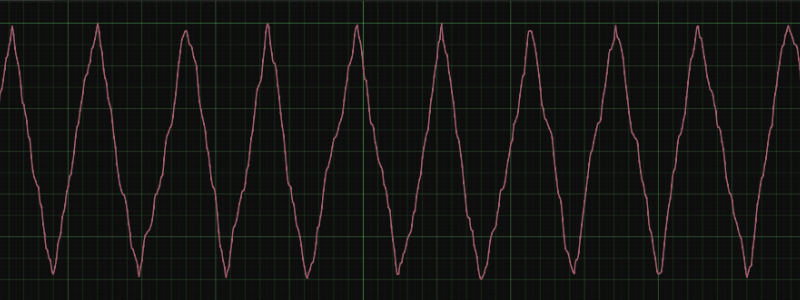
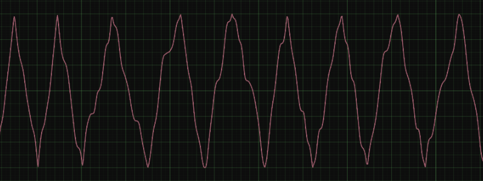

# Flicker Noise

This is a Nuke script that creates noise that moves in one direction until it hits the maximum of its range, and then in the other until it hits the minimum of its range. It's useful for situations where you want to make sure that your noise is hitting its minimum and maximum values consistently. It's essentially an irregular sawtooth wave.

For comparison, this is what Nuke noise looks like by default:

And this is what flicker noise looks like:

Download the script [here](/releases/latest). The constants at the top of the file control the noise's parameters. They each have comments explaining what they do.